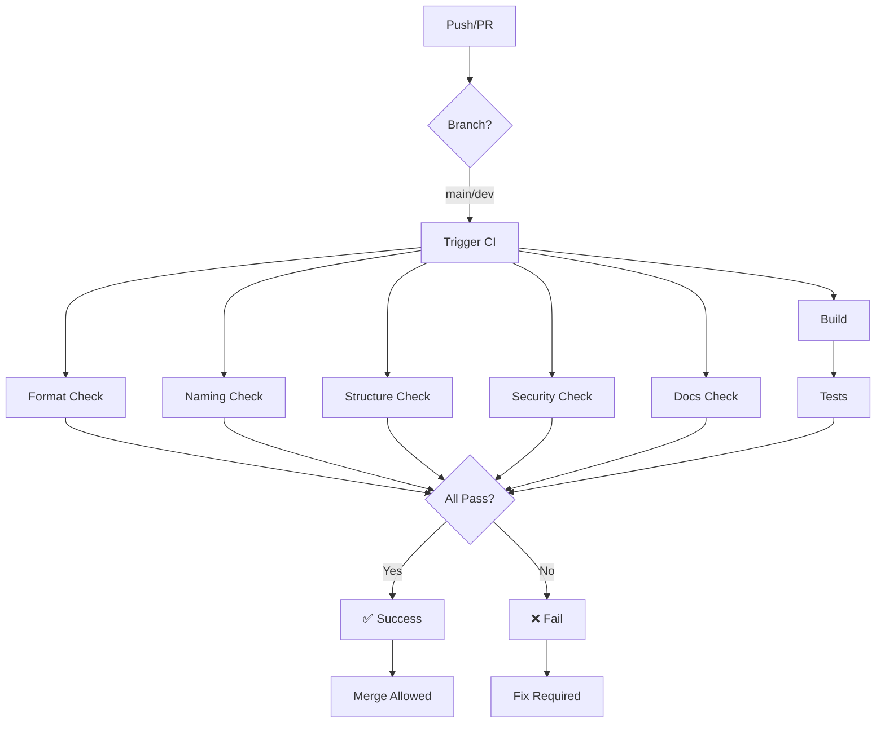

# 🚀 CI/CD - Gestus IAM

## 📋 Visão Geral

Este pipeline CI/CD valida **automaticamente** todos os padrões definidos no `PADRONIZACAO.md` sempre que há um push ou pull request para as branches `main` ou `dev`.

## ✅ Validações Executadas

### 1. 🎨 Formatação de Código
- Verifica se o código está formatado corretamente
- Usa `dotnet format --verify-no-changes`
- **Falha se**: Código não estiver formatado

**Como corrigir:**
```bash
dotnet format Gestus.sln
```

### 2. 🔨 Build e Análise Estática
- Compila o projeto em modo Release
- Trata warnings como erros (`/p:TreatWarningsAsErrors=true`)
- Executa analyzers de código
- **Falha se**: Build falhar ou houver warnings

**Como corrigir:**
```bash
dotnet build Gestus.sln --configuration Release
```

### 3. 🧪 Testes
- Executa todos os testes unitários
- Gera relatório de cobertura
- Publica resultados no Codecov
- **Falha se**: Algum teste falhar

**Como executar localmente:**
```bash
dotnet test Gestus.sln --configuration Release
```

### 4. 📝 Nomenclatura em Português
- Verifica se classes/interfaces/enums estão em português
- Verifica se métodos async têm sufixo `Async`
- **Falha se**: Encontrar nomes em inglês ou métodos async sem sufixo

**Exemplos:**
```csharp
// ✅ CORRETO
public class Usuario { }
public async Task<Usuario> ObterPorIdAsync(int id) { }

// ❌ INCORRETO
public class User { }
public async Task<Usuario> ObterPorId(int id) { }
```

### 5. 🏗️ Estrutura de Arquivos
- Verifica se há múltiplas classes públicas no mesmo arquivo
- Verifica se há DTOs dentro de controllers
- **Falha se**: Encontrar violações

**Padrão:**
- Um arquivo = Uma classe/interface/enum
- DTOs devem estar em `Gestus.Application/DTOs/`

### 6. 🔒 Segurança
- Verifica se há logs de dados sensíveis (senhas, tokens)
- Verifica se há secrets em arquivos de configuração
- **Falha se**: Encontrar secrets em `appsettings*.json`

**Avisos (não bloqueia):**
- Possíveis logs de senhas/tokens

### 7. 📚 Documentação
- Verifica se classes públicas têm XML comments
- **Não bloqueia o build**, apenas avisa

**Padrão:**
```csharp
/// <summary>
/// Descrição da classe
/// </summary>
public class MinhaClasse { }
```

## 🔧 Configuração Local

### Pré-requisitos
- .NET 10.0 SDK
- Git

### Instalar Ferramentas

```bash
# Instalar dotnet format (já vem com SDK 10.0)
dotnet tool restore

# Verificar instalação
dotnet format --version
```

### Validar Antes de Commitar

```bash
# 1. Formatar código
dotnet format Gestus.sln

# 2. Build
dotnet build Gestus.sln --configuration Release

# 3. Testes
dotnet test Gestus.sln --configuration Release

# 4. Verificar formatação
dotnet format Gestus.sln --verify-no-changes
```

## 📊 Status do Pipeline

O pipeline executa 7 jobs em paralelo (exceto testes, que dependem do build):

```
┌─────────────────────┐
│  format-validation  │
└─────────────────────┘
         │
         ├─────────────────────┐
         │  build-and-analyze  │
         └─────────────────────┘
                  │
         ┌────────┴────────┐
         │      tests      │
         └─────────────────┘
         │
         ├─────────────────────┐
         │ naming-validation   │
         └─────────────────────┘
         │
         ├─────────────────────┐
         │structure-validation │
         └─────────────────────┘
         │
         ├─────────────────────┐
         │security-validation  │
         └─────────────────────┘
         │
         ├─────────────────────┐
         │documentation-valid. │
         └─────────────────────┘
         │
         ▼
    ┌─────────┐
    │ summary │
    └─────────┘
```

## 🚫 Quando o Pipeline Falha

### Formatação
```
❌ Código não está formatado corretamente!
Execute: dotnet format
```

**Solução:**
```bash
dotnet format Gestus.sln
git add .
git commit --amend --no-edit
git push --force
```

### Nomenclatura
```
❌ Encontradas classes em inglês:
./Gestus.Domain/Entities/User.cs
```

**Solução:**
- Renomear `User.cs` para `Usuario.cs`
- Renomear classe `User` para `Usuario`

### Estrutura
```
❌ Arquivos com múltiplas classes públicas:
./Gestus.Domain/Entities/Aplicacao.cs tem 4 classes públicos
```

**Solução:**
- Separar em arquivos individuais
- `Aplicacao.cs`, `PermissaoAplicacao.cs`, etc.

### Segurança
```
❌ Secrets encontrados em arquivos de configuração:
appsettings.Development.json: "Password": "123456"
```

**Solução:**
- Usar variáveis de ambiente: `{ENV:DB_PASSWORD}`
- Usar User Secrets para desenvolvimento

## 📈 Cobertura de Código

A cobertura de código é enviada automaticamente para o Codecov após cada execução de testes.

**Ver cobertura:**
- Badge no README (após configurar Codecov)
- Dashboard do Codecov

## 🔄 Workflow Completo



## 🛠️ Customização

### Adicionar Nova Validação

Edite `.github/workflows/ci.yml` e adicione um novo job:

```yaml
my-custom-validation:
  name: 🔍 Minha Validação
  runs-on: ubuntu-latest
  
  steps:
  - name: 📥 Checkout código
    uses: actions/checkout@v4
    
  - name: 🔍 Executar validação
    run: |
      # Seu script aqui
      echo "Validando..."
```

### Desabilitar Validação

Comente o job no arquivo `.github/workflows/ci.yml`:

```yaml
# naming-validation:
#   name: 📝 Validação de Nomenclatura
#   ...
```

## 📝 Checklist Antes de Commitar

- [ ] Código formatado (`dotnet format`)
- [ ] Build sem erros (`dotnet build`)
- [ ] Testes passando (`dotnet test`)
- [ ] Nomenclatura em português
- [ ] Um arquivo = uma classe
- [ ] Sem dados sensíveis em logs
- [ ] Sem secrets em configs
- [ ] XML comments em classes públicas

## 🎯 Objetivo

**Garantir que TODO código que entra no repositório segue os padrões Gestus!**

Isso significa:
- ✅ Código limpo e consistente
- ✅ Fácil manutenção
- ✅ Segurança garantida
- ✅ Documentação completa
- ✅ Qualidade alta

---

**Última atualização:** 04/12/2025
**Versão:** 1.0